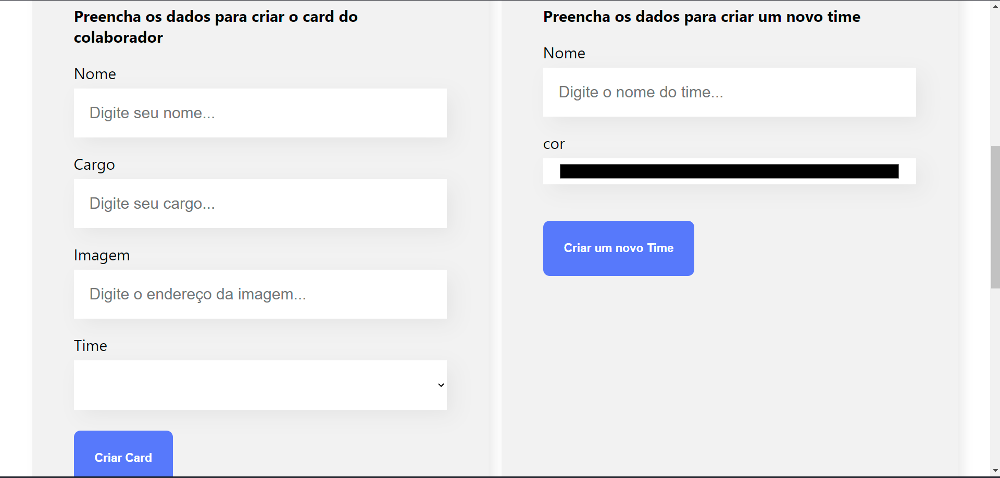
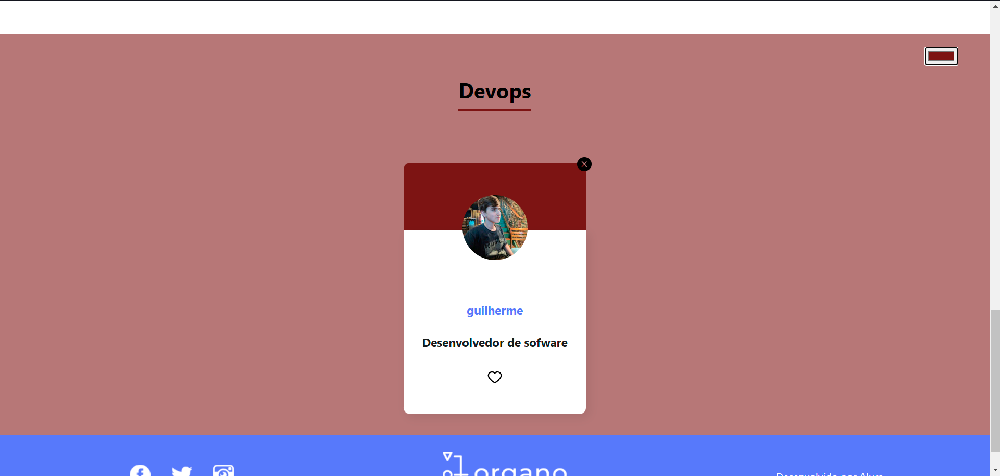

# Gerador de organogramas - Organo

> Aperte em :star: se gostou do projeto. Pull Request são muito bem vistos

Este projeto consite em uma aplicação web de cadastro de membros, ao acessar pela primeira vez é possível adicionar um membro definindo um nome, cargo, link da imagem e em qual time essa pessoa vai ficar, se nenhum dos times for o desejado, eu adicionei uma feature permetindo adicionar um nove time, escolhendo o nome e a cor, e logo em seguida ele já vai estar disponível para ser usado.

Principais tópicos usados nesse projeto:
  - Criação de componentes dinâmicos
  - O uso de Props para passar diversos valores, e até mesmo objetos
  - A importância da refatoração e de um código limpo
  - O uso de Hooks, como por exemplo UseState e o UseEffect
 
 Muitos outros tópicos foram aprendidos nesse projeto, sinta-se à vontade para baixar o projeto
 link do vercel: https://organo-beta-five.vercel.app;
 

    
    

